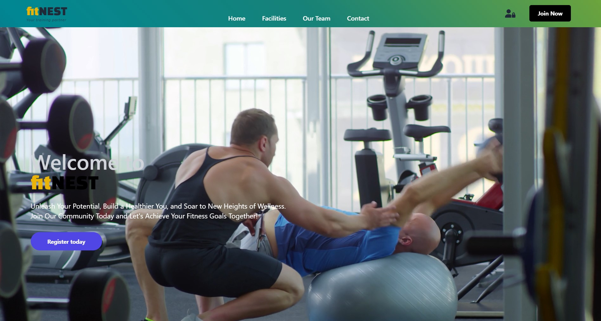

# App with Authentification Using Sequalize




## Description

The app lets you create a new account or login into an existing one. Within your account, you are able to book specific gym classes and check their availability.

**Sequelize** library provides an ORM (Object-Relational-Mapper) for Node.js and has been used to interact with MySQL database. This can be viewed or changed through **MySQL Workbench** on your local machine. 

## Installation

```bash
# Install dependencies for server
npm install

# Install dependencies for client
npm install

# Run the client & server with concurrently
npm run dev

# Run the Express server only
npm run server

# Run the React client only
npm run client

# Server runs on http://localhost:8000 and client on http://localhost:5173
```

## Instructions to create the database

A sample database can be created when launching the server, but you will need to have the MySQL server installed and running.

Please ensure that you update the **sequelize** variable in both the **recreate-database.js** and **UserX.js** files with the correct configuration settings to connect to your MySQL server. Make sure to match the username and password values to your MySQL login credentials.

In your database create a new schema for your application named **gym**.

Running the following command in the terminal in the root folder will create the sample table for you.  

```bash
cd database && node createSampleDB
```

## API Testing Endpoints

- PUT : `http://localhost:8000/api/users/update`
- GET : `http://localhost:8000/api/users`
- GET : `http://localhost:8000/api/users/delete/`
- POST: `http://localhost:8000/api/users/register/`
- POST: `http://localhost:8000/api/auth/login`

## Purpose

- Practice
- Improve knowledge on MERN apps
  