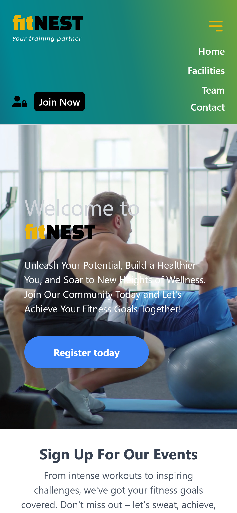

# fitNEST - GYM

## Authentification Using Sequalize and Cloud Stored MySQL Database


[](https://fitnest.vercel.app/)
[](https://fitnest.vercel.app/)

## Description

-   The app uses **React** routing to navigate between different pages of the app.
-   An **Express** server has been set up for user authentification and registration.
-   **Sequelize** library has been used as an ORM (Object-Relational-Mapper) for **Node.js** in order to interact with MySQL database.
-   A database can be configured for testing locally using **MySQL Workbench**.
-   The database is being accessed from a mySQL server configured using [Clever Cloud Console](https://console.clever-cloud.com/).
-   After a successful login the user will be redirected to the user dashboard page.
-   Following registration user paswords are **hashed** before being stored in the database.

### **Deployed on VERCEL** : [fitNEST-app](https://fitnest.vercel.app/)

<div style="text-align: center">

  
</div>

## Installation

```bash
# Install dependencies for server
npm install

# Install dependencies for client
npm install

# Run the client & server with concurrently
npm run dev

# Run the Express server only
npm run server

# Run the React client only
npm run client

# Server runs on http://localhost:8000 and client on http://localhost:3000
```

## Requirements

-   ### MySQL Local Server - Development

    -   [MySQL](https://dev.mysql.com/downloads/installer/) server installed and running locally.

    -   MySQL database created locally in order for the user authentication or registration to work properly.
        -   **SCHEMA name : 'gym'**
        -   **TABLE name : 'users'**
    -   MySQL login credentials will need to be ammended per user cofiguration on **_client/database/database.js_**.

-   ### MySQL Cloud Server - Production

    -   A cloud MySQL server has been configured to be able to access the login and register functionality.
    -   MySQL cloud configuration shall match the variables stored in the **_.env_** file stored in the root folder of the app.

## API Testing Endpoints

-   GET : `http://localhost:8000/api/users`
-   POST: `http://localhost:8000/api/users/register/`
-   POST: `http://localhost:8000/api/auth/login`

[**Postman**](https://www.postman.com/) or any similar application can be used for testing API requests.

## Purpose

-   Practice
-   Improve knowledge on full stack development.
