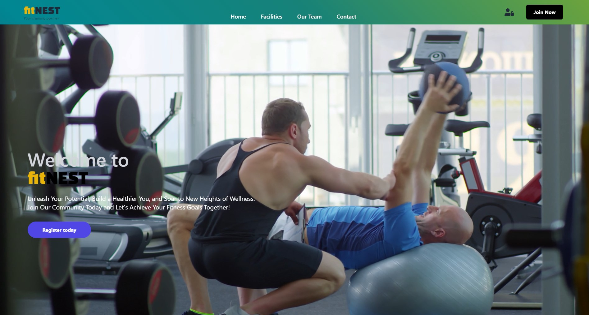

# fitNEST - GYM

## Authentification Using Sequalize and Cloud Stored MySQL Database


[](https://fitnest.vercel.app/)
[](https://fitnest.vercel.app/)

## Description

The app lets you create a new account or login into an existing one. Within your account, you are able to book specific gym classes and check their availability.

**Sequelize** library has been used as an ORM (Object-Relational-Mapper) for Node.js in order to interact with MySQL database. This can be viewed or changed through **MySQL Workbench** on your local machine.

### **Deployed on VERCEL** : [fitNEST-app](https://fitnest.vercel.app/)
<div style="text-align: center">

  
</div>
## Installation

```bash
# Install dependencies for server
npm install

# Install dependencies for client
npm install

# Run the client & server with concurrently
npm run dev

# Run the Express server only
npm run server

# Run the React client only
npm run client

# Server runs on http://localhost:8000 and client on http://localhost:3000
```

## Requirements

### Locally - testing

- [MySQL](https://dev.mysql.com/downloads/installer/) server installed and running locally.

- MySQL database created locally in order for the user authentication or registration to work properly.

  - **SCHEMA name : 'gym'**
  - **TABLE name : 'users'**

### Cloud based - production

A cloud MySQL server has been configured to be able to access the login and register functionality.

Login credentials for the server ***client/database/database.js*** are stored in the ***.env*** file

- #### **MySQL Cloud Server** : [Clever Cloud Console](https://console.clever-cloud.com/)

## API Testing Endpoints

- GET : `http://localhost:8000/api/users`
- POST: `http://localhost:8000/api/users/register/`
- POST: `http://localhost:8000/api/auth/login`

## Purpose

- Practice
- Improve knowledge on full stack development.
  